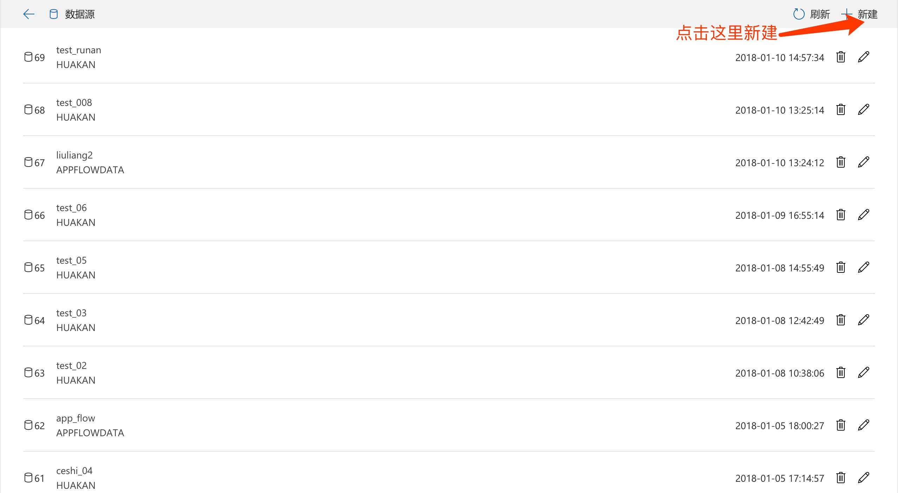
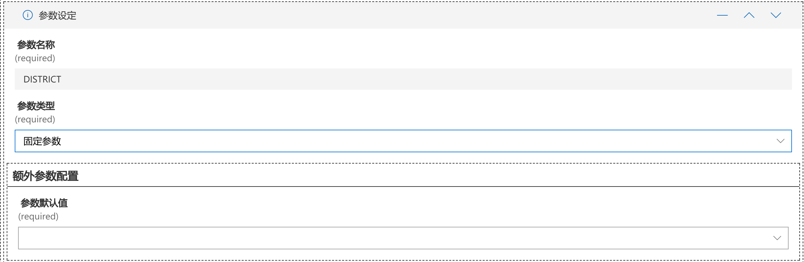
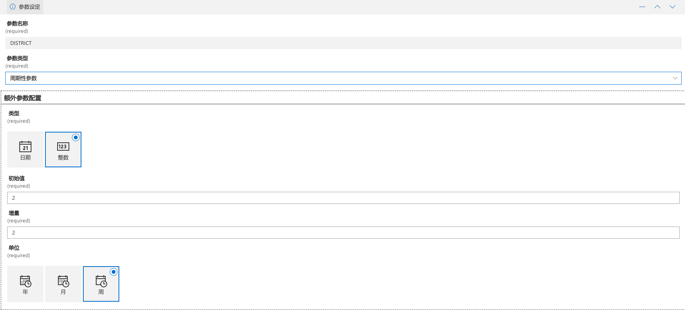
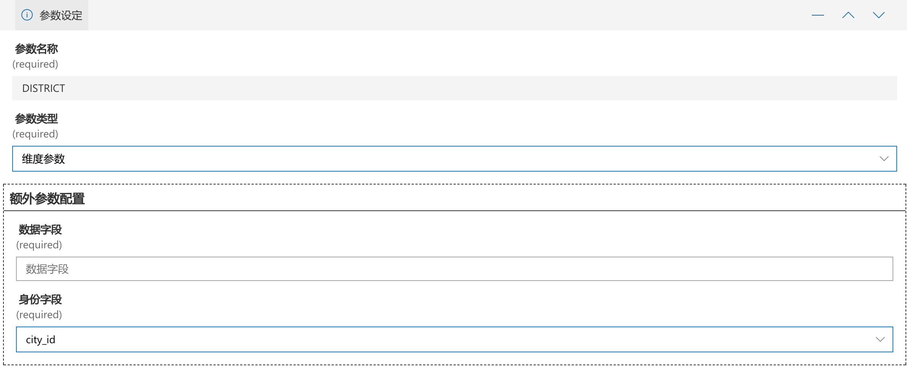
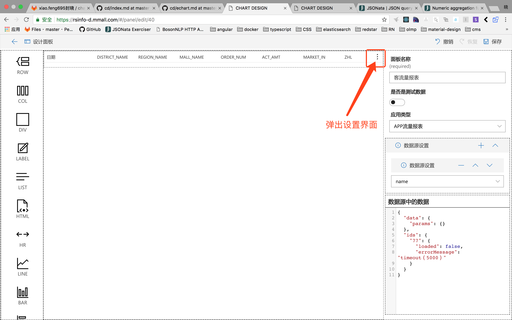
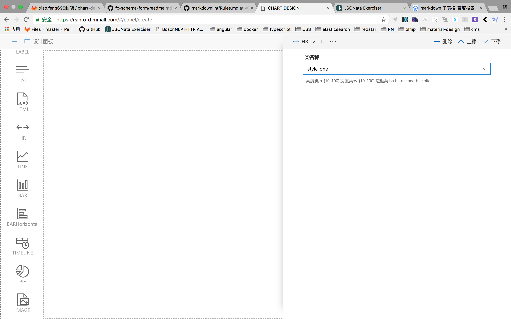

# 流量报表

为app来生成html的界面，并添加数据源中的动态数据。

[项目地址](http://code.corp.rs.com/xiao.feng695/chart-design-static.git)

[线上地址](https://rsinfo-d.mmall.com)

## 目录

- [首页](#首页)
- [数据源](#数据源)
  - [新建数据源](#新建数据源)
    - [数据源字段说明](#数据源字段说明)
  - [修改数据源](#修改数据源)
  - [删除数据源](#删除数据源)
- [面板](#面板)
  - [新建面板](#新建面板)
    - [面板字段说明](#面板字段说明)
  - [修改面板](#修改面板)
  - [删除面板](#删除面板)
- [预览](#预览)
  - [预览效果](#预览效果)
- [关于动态属性](#关于动态属性)

## 主页

> 三大主内容的入口

## 数据源

> 列出所有的数据源

### 新建数据源

> Note: 保存后会变成编辑模式；

#### 数据源字段说明

- 连接名称。当前连接的名字；后面选择数据需要用到；
- 应用类型。当前的引用类型，目前有app流量报表和数联；
- 流量报表类型。只有当【应用类型】是app流量报表的时候才需要填写；
- 数坊中的数据源ID。对应数坊中的一张表；
- 参数设定。当选择完【数坊中的数据源ID】后出现；这里需要填写参数的信息；
  - 参数名称。参数对应的名称；
  - 参数类型。目前有3中选项：固定、周期性和纬度；
    - 固定参数；参数为固定值；需要填写这个参数的具体值；
    
    - 周期性参数。参数会根据周期自动增加；
      - 类型：只支持日期和数字的增量方式；
      - 初始值：填写一个具体的值；
      - 增量：增量值；
      - 单位：当【类型】是日期的时候需要选择值；
    
    - 纬度参数。会根据当前用户身份中字段来过滤数据；
      - 数据字段：对应数坊中的字段名称；
      - 身份字段：从当前登录用户中提取的数据字段名称；
    

### 修改数据源

同新建数据源；

### 删除数据源

点击删除按钮，弹出确认删除对话框，点击确定按钮，删除数据源。

## 面板

列出所有的面板，提供编辑，新建和删除功能。

### 新建面板

#### 面板字段说明

- 面板名称
- 是否是测试数据
- 应用类型
  - 数联情报物
  - APP流量报表
- 数据源设置：配置数据源，用于加载数据。
- 数据源中的数据：查看【数据源设置】中配置的数据源的数据
- 组件。通过拖拽最左侧的组件来组合。

#### 组件说明

> Row

占据整行（分为12格），子元素只能是Col

参数说明：

| 属性      |  类型|说明                |
| -------- |:--- |-----:              |
| 类名称    | String |html中的class      |
| 宽度      | String|宽度设置，字符串格式，如果是固定值，记得带上单位|
| 高度      | String|高度设置，字符串格式，如果是固定值，记得带上单位|

> Col

只能放在Row中。可以根据屏幕尺寸的不同设置不同的占屏比，移动优先。

- 小屏：320px - 479px
- 中等屏：480px - 639px
- 大屏：640px - 1023px

参数说明：

| 属性      | 类型|说明                |
| -------- |:--- |-----:              |
| 类名称    | String |html中的class      |
| 宽度      | String |宽度设置，字符串格式，如果是固定值，记得带上单位|
| 高度      | String |高度设置，字符串格式，如果是固定值，记得带上单位|
| 小屏：格子数| Number |占据Row的格子数，整型，不能超过12|
| 小屏：左边空格数| Number |左边空出的格子数|
| 小屏：右边空格数| Number |右边空出的格子数|
| 中等屏：格子数| Number |占据Row的格子数，整型，不能超过12|
| 中等屏：左边空格数| Number |左边空出的格子数|
| 中等屏：右边空格数| Number |右边空出的格子数|
| 大屏：格子数| Number |占据Row的格子数，整型，不能超过12|
| 大屏：左边空格数| Number |左边空出的格子数|
| 大屏：右边空格数| Number |右边空出的格子数|

> Div

可移动和拉伸的DIV，只能放在Root容器中。

参数说明：

| 属性      | 类型 | 说明                |
| -------- |:-------- |-----:|
| x        | Number | div离开Root左边的距离 |
| y        | Number | div离开Root顶点的距离|
| 宽度      | Number | div的宽度|
| 高度      | Number | div的高度|

> Label

文本显示组件。

参数说明：

| 属性      | 类型 | 说明                |
| -------- |:-------- |-----:|
| 显示文本   | String | 动态数据 |
| fontSize   | Number | 字号|
| textAlign  | Number | 文字居中方式，left、right、center|

> List

列表组件

参数说明：

| 属性      | 类型 | 说明                |
| -------- |:-------- |-----:|
| itemsDeg   | String | 动态数据，选择一个数据源(自动填充表格列) |
| 表格列   | Array | 表头的设置，参照【表格列属性】 |

表格列属性：

| 属性      | 类型 | 说明                |
| -------- |:-------- |-----:|
| fieldName   | String | 数据集中对应的字段名 |
| key   | String | key值 |
| name   | String | 表头名称 |
| currentWidth   | Number | 表头的宽度 |

> Hr

分割线。

参数说明：

| 属性      | 类型 | 说明                |
| -------- |:-------- |-----:|
| 类名称   | String | 样式，提供了8中样式 |

> Echart组件

对Echart做了一层封装，暴露出必要的参数。[Echart参数说明。](./echart.md)

- Line

- Bar

- BARHorizontal

- Pie

> Image

图片组件。

参数说明：

| 属性      | 类型 | 说明                |
| -------- |:-------- |-----:|
| 类名称   | String | 样式 |
| Link   | String | 点击图片跳转的链接地址 |
| imageFit   | String | 图像如何缩放和裁剪 |
| coverStyle   | String | 剪裁样式 |
| Link   | String | 点击图片跳转的链接地址 |
| srcsDeg   | String | 动态数据，用于处理图片的地址 |
| title   | String | 动态数据，用于处理图片的标题 |

### 修改面板

同新建面板

### 删除面板

点击删除按钮，弹出确认删除对话框，点击确定按钮，删除面板。

## 预览

列出所有的面板信息，点击可以查看展示效果。

### 预览效果

### 关于动态属性

动态属性，依赖于【数据源中的数据】，是从数据中使用特定语法去获取数据。[语法说明（需要翻墙）。](http://docs.jsonata.org/)

举个例子,如图配置：

这里选择了一个数据源名为【test_02】，数据也已经展示在了图右侧的下方。

【test_02】的数据是一个数组，数组中的每一项都有MALL_CODE，MALL_NAME，REGION_TYPE，ORDER_AMOUNT这4个字段。

获取所有的【MALL_NAME】： $$."test_02"."MALL_NAME" 即可。 (这里$$代表根，根的数据路径是data，相当于data.test_02.MMALL_NAME)

还支持一个简单的聚合：$average,$min,$max,$sum等，具体的查看[文档](http://docs.jsonata.org/aggregation-functions.html)。

上图中，线图的横轴设置的轴数据，取的就是test_02数据源中的MALL_NAME字段，而曲线设置中的第一个曲线的数据取的是test_02数据源中的ORDER_AMOUNT字段，这样就会生成如图的线图。