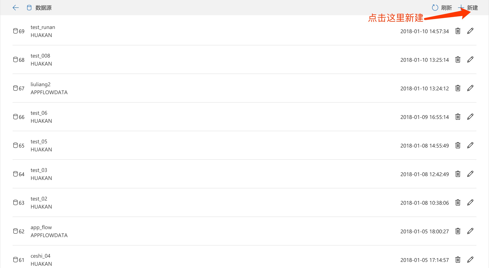
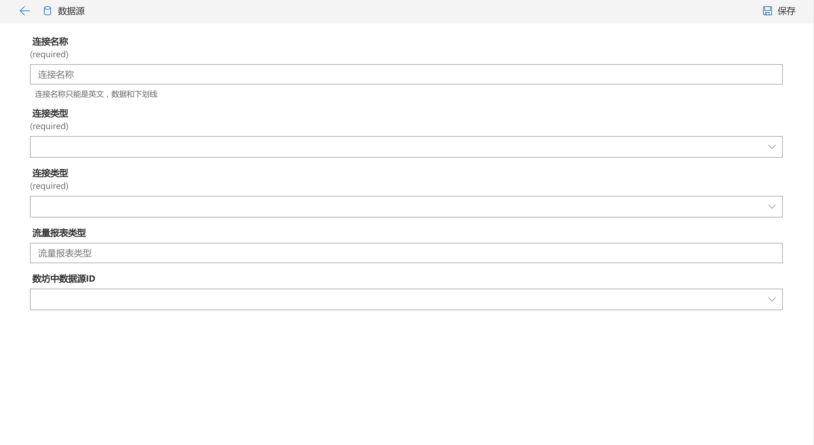
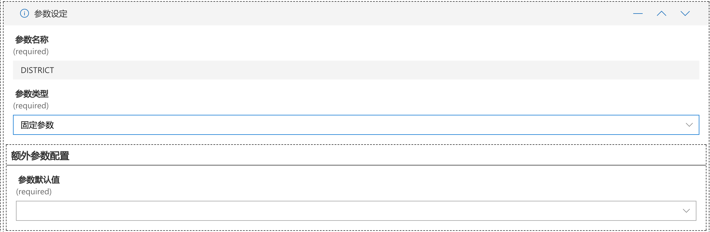
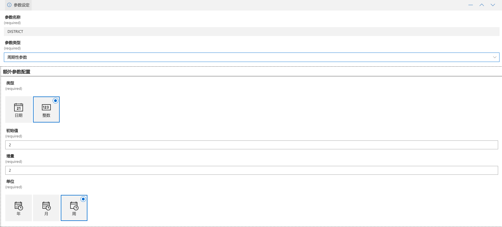
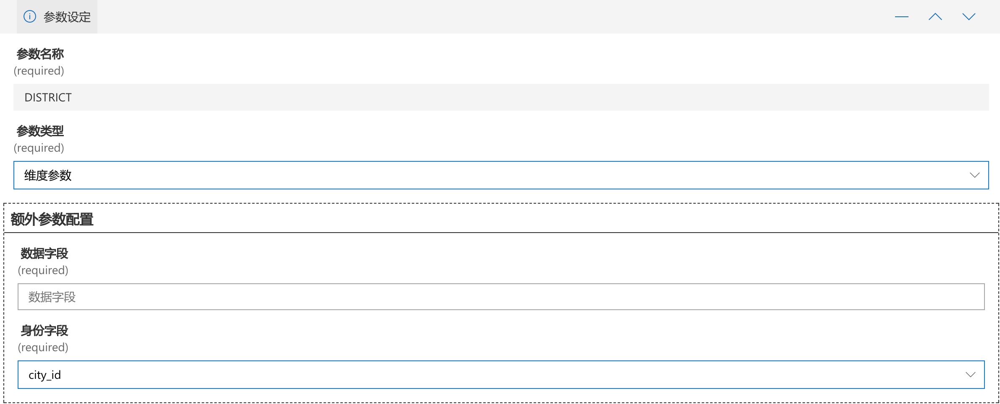
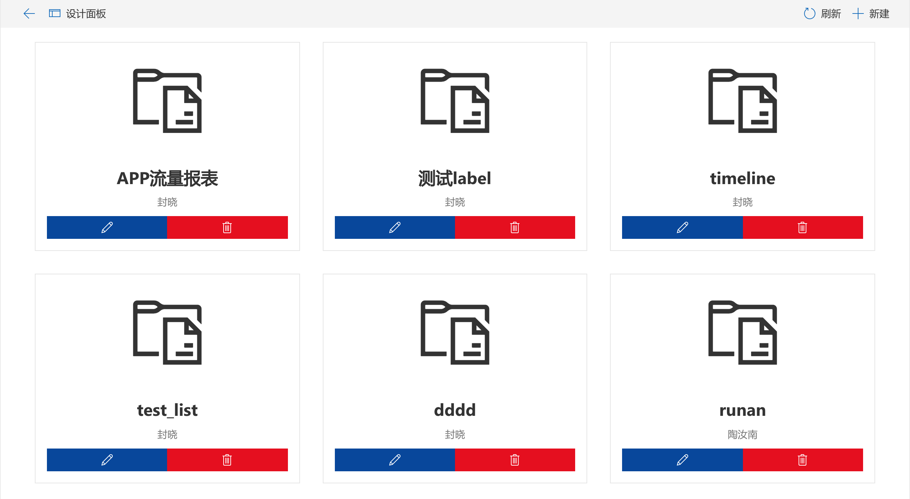
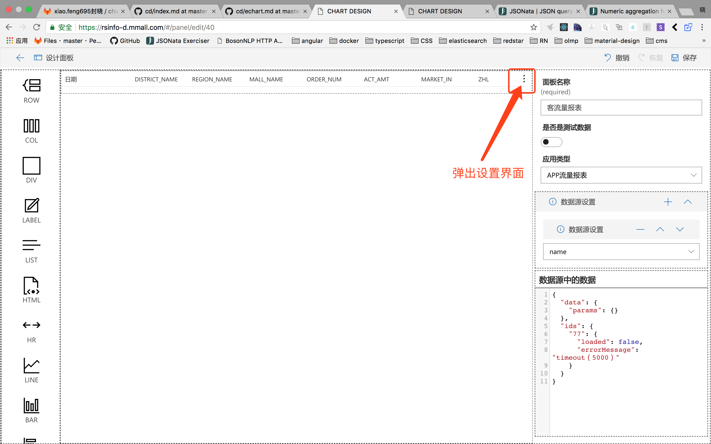

# 操作文档

## 目录

1. [数据源](#source)
2. [面板](#panel)
    + Row
    + Col
    + Div
    + Label
    + List
    + Hr
    + Line
    + Bar
    + BarHor
    + Timeline
    + Pie
    + Image
3. [预览](#preview)

## <a name="source">数据源</a>

> *列表页*

这里列出了所有已经建好的数据源；可以新建，修改和删除数据源；

> *新建页面*

### 字段说明

+ 连接名称。当前连接的名字；后面选择数据需要用到；
+ 应用类型。当前的引用类型，目前有app流量报表和数联；
+ 流量报表类型。只有当【应用类型】是app流量报表的时候才需要填写；
+ 数坊中的数据源ID。对应数坊中的一张表；
+ 参数设定。当选择完【数坊中的数据源ID】后出现；这里需要填写参数的信息；
    - 参数名称。参数对应的名称；
    - 参数类型。目前有3中选项固定，周期性和纬度；
        + 固定参数；参数为固定值；需要填写这个参数的具体值；
        
        + 周期性参数。参数会根据周期自动增加；
            - 类型：只支持日期和数字的增量方式；
            - 初始值：填写一个具体的值；
            - 增量：增量值；
            - 单位：当【类型】是日期的时候选择；
        
        + 纬度参数。会根据当前用户身份中字段来过滤数据；
            - 数据字段：
            - 调整后的字段：
        

> Note: 保存后会变成编辑模式，退出新建界面后失效；

## 面板

> *列表页*

这里列出了所有已经建好的面板；可以新建，修改和删除数据源；

> *新建面板*

### 字段说明

+ 面板名称。名称。
+ 应用类型。区分各个业务系统。
+ 数据源设置。配置当前面板所使用的数据源，可以有多个。
+ 数据源中的数据。这里会调用【数据源设置】的数据源，填充数据到该字段，用于组件的数据渲染。

### 组件说明

> Row。用于渲染一行。

> Col。用于渲染一列。必须放在Row中，为row的子组件

> Div。可拖拽，可缩放的组件。

> Label。文本显示组件。

> List。数据表格组件。

> Hr。分割线。

> Line。echart中Line组件

> Bar。echart中Bar组件

> BarHor。echart中HorBar组件

> Timeline。echart中timeline组件

> Pie。echart中Pie组件

> Image。图片组件。

> Note:关于动态属性，目前支持动态数据的组件有：Label，Line，Bar，BarHoc，Pie，Image;

### 组件属性面板

## 预览
